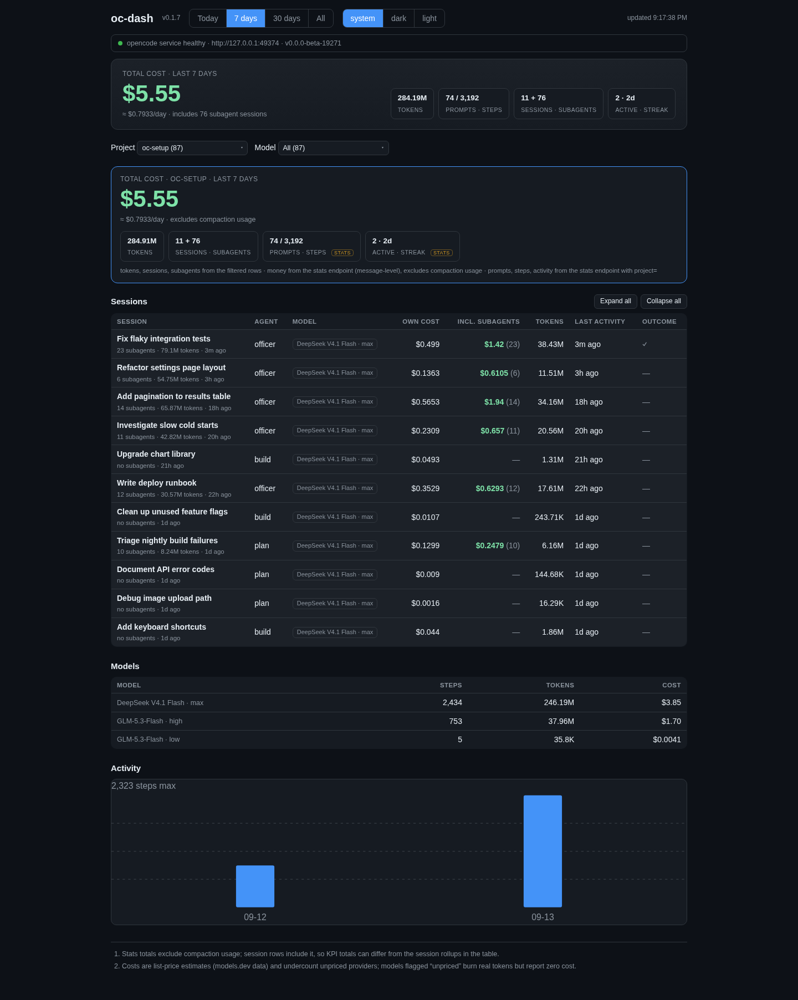

# oc-dash

Track exactly what AI usage costs in opencode2. oc-dash is a local dashboard
over the service API that shows spend session by session, subagents included,
under any time range and filter combination.

## What it looks like

One page: a cost hero, project and model filters with a filtered totals card,
then the sessions table, the models table, and an activity chart.



## What you can learn

- The total spend for a range, with a per-day average when the range covers
  full days, plus tokens, prompts, steps, sessions, subagents, and streaks.
- Spend per project and per model under combined filters. Pick one or both;
  the filtered totals card recomputes for the cut on screen.
- Subagent spend. Child sessions nest under their parent, and the Incl.
  subagents column rolls descendant cost into the parent at any depth.
- Which sessions cost the most. Click the Own cost, Incl. subagents, or
  Tokens header to sort; each cycles default, ascending, descending.
- Which models burned tokens at zero reported cost. The Models table flags
  them `unpriced`.

## Reading the numbers

- A number served by the stats endpoint is exact for the window and filter
  cut on screen.
- When a cut cannot be served, the card sums the session rows instead and
  marks the result `≈` (approximate). The fallback is labeled, never silent.
- If stats and the session rows disagree about a model, the card says so
  instead of showing either number.
- Stats totals exclude compaction usage. Session rows and the directory
  fallback include it, so the two totals can differ.
- Costs are list-price estimates from models.dev, not your bill, and models
  that burn tokens at zero reported cost are undercounted.

## Quick start

Requires Node 22+ with npm, and a running opencode2 service from the
compatible beta line. oc-dash only issues read-only GETs and never starts,
stops, or restarts the service.

```sh
npx @webfueler/oc-dash
```

Serves the dashboard on http://localhost:4021. Override the port with `PORT`,
for example `PORT=4022 npx @webfueler/oc-dash`.

When no registered service answers the startup probe, oc-dash prints a short
message and exits non-zero. Start the service with `opencode2 serve --service`.

No opencode2 yet? Install the beta line with
`npm install -g @opencode-ai/cli@beta`; it puts the `opencode2` command on
your PATH. Exact money needs the stats route, which the beta line serves
(`@latest` does not yet). To skip `npx`, `npm i -g @webfueler/oc-dash` puts
`oc-dash` on your PATH.

## Using the dashboard

Ranges sit in the top bar: Today, 7 days, 30 days, All. A range switch
refetches and collapses the session tree.

The project and model filters sit above the tables, each with an All entry
and live counts. Type to search: projects match their full path, models their
display name and raw id. The model filter ignores reasoning variants; held
values survive range switches with a truthful 0 when nothing matches.

The filtered totals card appears whenever either filter is active. Its money
comes from the stats engine when the exact cut can be served; otherwise it is
the row sum, marked `≈`. A project filter on its own unlocks extra stats
tiles (prompts, steps, activity, any positive compaction gap); a model filter
hides them.

Sessions nest under their parent, collapsed by default. Click a parent row or
press Enter/Space to expand it; Expand all and Collapse all sit in the
section head. Own cost is the session's own spend, Incl. subagents adds every
descendant. The model chip shows the display name, with the raw
`providerID/id · variant` on hover.

If the stats endpoint is down, the hero carries a fallback badge and totals
from the session rows, the filtered card labels its money approximate, and
the Models table stays empty. The dashboard refreshes every 30 seconds while
the tab is visible, and right away when it becomes visible again.

## Known limits

- The opencode2 API and client are beta; a service update can change
  behavior. Exact money needs a service that serves `session.stats`.
- The session walk stops after 50 pages of 100 rows. When it truncates, the
  dashboard warns and a directory filter falls back to the approximate row sum.
- The service endpoint is discovered once and cached. If the service comes
  back on a new port, restart the dashboard.
- Without a healthy service at startup, oc-dash exits. It never starts or
  restarts one.

## Development

Stack: Hono on Node 22 serves the API and built frontend from one process.
Frontend: React + Vite + TypeScript, plain CSS, inline-SVG chart. Tests use
vitest across the server routes, walk, and client logic; lint uses eslint.

```sh
npm install
npm run dev     # API on 4021, Vite on 5273, /api proxied to 4021
npm run build   # typecheck, bundle the frontend, compile the server
npm run start   # serve the build on 4021
npm test        # vitest
npm run lint    # eslint
```

The backend talks to the service through `@opencode/client`, pinned to an
exact beta build, and is discover-only. See
[docs/API.md](https://github.com/webfueler/oc-dash/blob/main/docs/API.md) for
the backend routes, the range mapping, and the project layout.

## License

MIT. Source, issues, and releases: https://github.com/webfueler/oc-dash.
